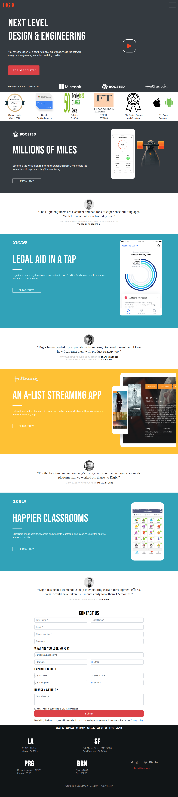
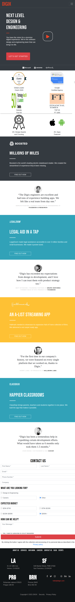
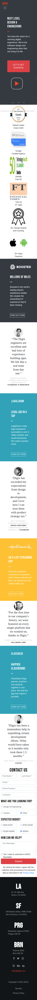

# Digix Engineers Mastery Challenge 

## Context

Digix is a Software Design and Engineering Team based out of Boston which is now focussing on building digital experiences for it's customers. Most of the leads for Digix are generated from the enquiry form on the company's website which showcases all it's accomplished projects. Witnessing the the recent trends the company found out that there was a drop in lead generation. The primary reason of this was that most of the users were visiting the site from Mobile Devices which failed to adapt well on the smaller screen sizes which led them to drop within 5s.

## Challenge

As a Front End Developer of Digix, transform the existing page design to a responsive page design so that the company's site adapts well on smaller screen sizes.

**Desktop Image**

**Tab Image**

**Mobile Image**

## Details
1. All the assets required can be found in the `./assets` folder